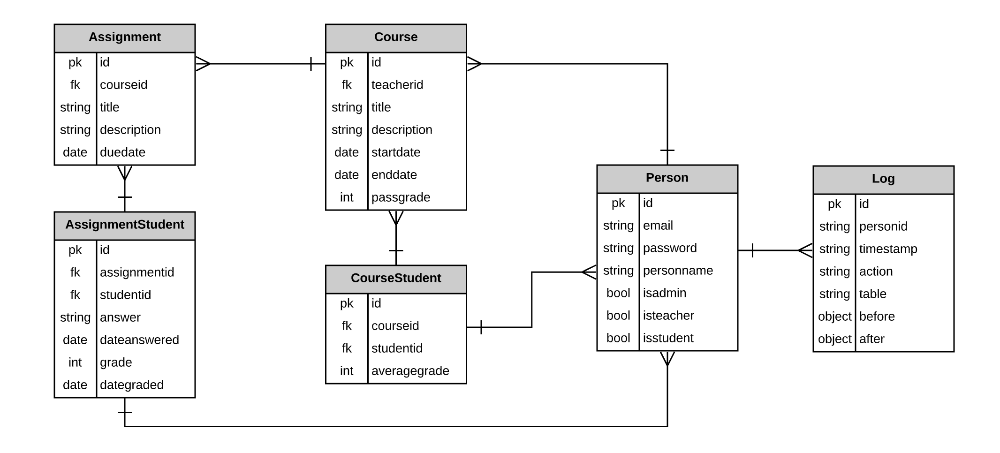

# AWSchool - Capstone Project

## Learning Goals

- Demonstrate self-direction, time management, and independent learning
- Learn and implement new technologies
- Gain experience with React and learn AWS technologies (S3, API Gateway, Lambda and DynamoDB)
- Complete a product lifecycle from conception to delivery
- Utilize agile practices learned to assist in project completion

## Description

Create a website where teachers can assign homework to their students.
Students can view their assigned homework.
This is useful for schools using remote learning due to Covid - 19.

## Features

### As a User, I can

- Login
- Logout

### As a School Administrator, I can

- View/add/edit/delete teachers
- View/add/edit/delete students
- View/add/edit/delete courses
- Assign teachers to courses
- Assign students to courses

### As a Teacher, I can

- View my courses
- View/add/edit/delete assignments
- View/grade answers

### As a Student, I can

- View my courses
- View assignments
- View/add/edit/delete answers

## Problem Statement

Teachers and students are working online more than ever. Coordinating homework assignments can be difficult. This project aims to offer a simple solution so teachers can share assignments and students can provide their answers, all using an easy website.

## Project Information

### Technology Stack

- Front-End
  - NodeJS
  - React
  - AWS S3
- Back-End
  - AWS API Gateway
  - AWS Lambda Functions
  - AWS DynamoDB


### Steps to Create Solution

- Create AWS DynamoDB tables
- Create AWS Lambda (serverless) functions to access AWS DynamoDB tables
- Create AWS API Gateway routes to AWS Lambda functions
- Build UI using a NodeJS React application
- Integrate REST API with React application
- Deploy application to AWS S3

### ERD



**Note**: AWS DynamoDB is a NoSQL Database, so the relationships described in the diagram are enforced in the code, not in the database.

### URL User Experience


## Sample Data

### Person

```json
{
  "id": 5,
  "email": "annamarie@gmail.com",
  "password": "1234",
  "personname": "Anna Marie",
  "isadmin": true,
  "isteacher": true,
  "isstudent": true
}
```

### Course

```json
{
  "id": 2,
  "teacherid": 3,
  "title": "Math",
  "description": "Fundamentals of Math",
  "startdate": "08/03/2020",
  "enddate": "01/08/2021",
  "passgrade": 2.7
}
```

### CourseStudent

```json
{
  "id": 1,
  "courseid": 1,
  "studentid": 1,
  "averagegrade": 3.2
}
```

### Assignment

```json
{
  "id": 1,
  "courseid": 1,
  "title": "hello world",
  "description": "Write a hello world program in Java",
  "duedate": "07/07/2020"
}
```

### AssignmentStudent

```json
{
  "id": 1,
  "assignmentid": 1,
  "studentid": 1,
  "answer": "class HelloWorld {\n public static void main(String[] args) {\n System.out.println(`Hello, World!`); \n }\n}",
  "dateanswered": "07/03/2020",
  "grade": 3.4,
  "dategraded": "07/05/2020"
}
```

## Validations

### Person

- ID – a person must have a unique ID.
- Email – a person must have an email.
- Password – a person must have a password with at least 4 characters. In the front end, the password must be typed twice and the two must match.
- A person must have a name.
- A person must be an administrator, a teacher, a student or a combination of the three.

### Course

- ID – a course must have a unique ID.
- Teacher ID – a course must have a teacher ID.
- Title – a course must have a title.
- Description – a course must have a description.
- Start Date – a course must have a start date.
- End Date – a course must have an end date. End date must be on or after the start date.

### CourseStudent (enrollment)

- ID – an enrollment must have a unique ID.
- Course ID – an enrollment must have a course ID.
- Student Id – an enrollment must have a student ID. The student cannot be the course teacher.

### Assignment

- ID – an assignment must have a unique ID.
- Course ID – an assignment must have a course ID.
- Description – an assignment must have a description.
- Due Date – an assignment must have a due date.
- Title – an assignment must have a title.

### AssignmentStudent (answer)

- ID – an answer must have a unique ID.
- Assignment ID – an answer must have an assignment ID.
- Student ID – an answer must have a student ID.
- Answer – an answer must have an answer.
- Date Answered – an answer must have a date answered.

## Project Waves

### Wave 1

- Create tables in AWS DynamoDB

  - Person
  - Course
  - Enrollment
  - Assignment
  - AssignmentStudent

- Create role with permission for table access in AWS IAM

  - Permission for Lambda functions to access AWS DynamoDB

### Wave 2

- Create AWS Lambda functions

  - List Person
  - Add/Edit Person
  - Delete Person
  - List Courses
  - Add/Edit Course
  - Delete Course
  - Add Student to Course
  - Delete Student from Course
  - List Assignments
  - Add/Edit Assignment
  - Delete Assignment
  - List Assignment Student
  - Add/Edit Assignment Student

### Wave 3

- Create React application

  - Login/Logout
  - Home Page
  - Admin: Person (list, add, edit, delete)
  - Admin: Courses (list, add, edit, delete)
  - Admin: Students by Course (list, add, delete)
  - Teacher: Courses (list)
  - Teacher: Students by Course (list)
  - Teacher: Assignments by Course (list, add, edit, delete)
  - Teacher: Assignment Answers by Assignment (list, grade)
  - Students: Courses (list)
  - Students: Assignments by Course (list, answer)
  - Add validations for Front and Back End

### Wave 4

- React Deployment on AWS S3

## Notes

- AWS API Gateway Bug

Model failure shows error about CORS.
I was getting an error saying the API call was blocked because of CORS, but it turns out it was a failure of my post request body to match the model defined in the API Gateway ( I was passing an empty string and it expected a Boolean). I spent a day debugging CORS and the problem was in my request body.
